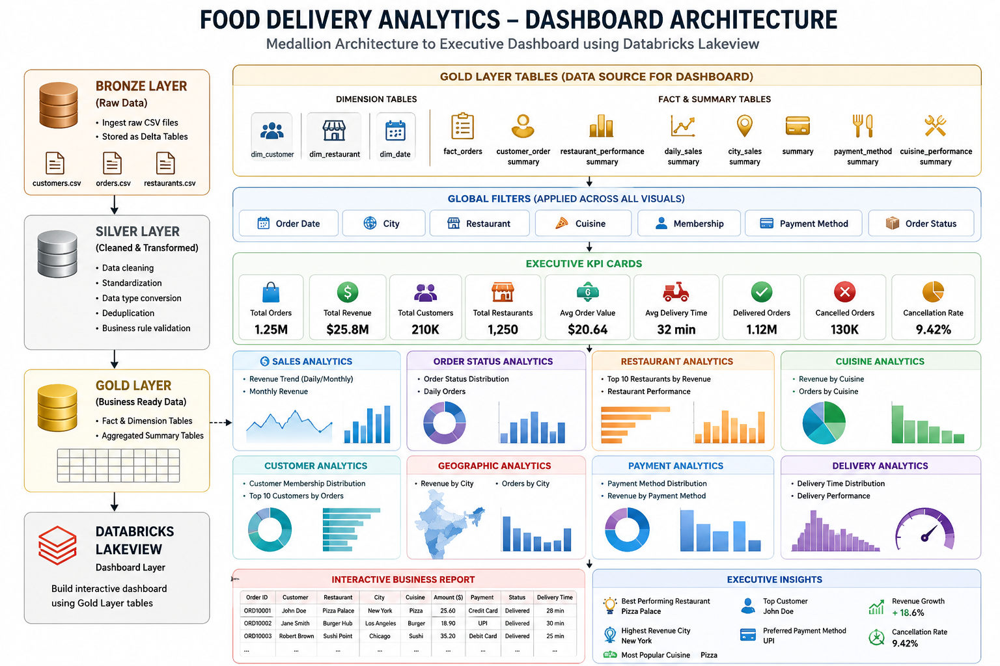

<div align="center">

# 🍔 Food Delivery Analytics using Databricks Medallion Architecture

### End-to-End Data Engineering Project

Transforming raw food delivery data into business-ready insights using **Databricks**, **PySpark**, **Spark SQL**, **Delta Lake**, and **Lakeview Dashboard**.


</div>

---

# 📖 Project Overview

This project demonstrates an end-to-end Data Engineering pipeline for a Food Delivery platform using the Databricks Medallion Architecture.

The pipeline ingests raw customer, restaurant, and order datasets, performs data cleansing and transformation with PySpark, stores data in Delta Lake, builds analytical fact and dimension tables, and presents business insights through an interactive Lakeview Dashboard.

---

# 🎯 Business Objectives

- Build a scalable Medallion Architecture
- Ingest raw food delivery datasets
- Improve data quality through cleansing and validation
- Create analytical Gold Layer tables
- Build executive business dashboards
- Generate actionable business insights

---

# 🏗 Project Architecture



---

# ⚙️ Technology Stack

| Technology | Purpose |
|------------|---------|
| Databricks | Data Engineering Platform |
| PySpark | ETL Processing |
| Spark SQL | Analytics |
| Delta Lake | Storage |
| Lakeview | Dashboard |
| GitHub | Version Control |

---

# 📂 Source Datasets

- Customers
- Orders
- Restaurants

---

# 🥉 Bronze Layer

The Bronze Layer stores raw data exactly as received from the source system.

### Features

- Raw CSV Ingestion
- Metadata Generation
- Ingestion Timestamp
- Delta Tables


---

# 🥈 Silver Layer

The Silver Layer cleanses and standardizes the data.

### Transformations

- Duplicate Removal
- Null Handling
- Date Standardization
- Data Type Conversion
- Business Rule Validation


---

# 🥇 Gold Layer

The Gold Layer contains business-ready analytical datasets.

### Fact Table

- Fact Orders

### Dimension Tables

- Dim Customer
- Dim Restaurant
- Dim Date

### Business Summary Tables

- Daily Sales Summary
- Restaurant Performance
- Customer Order Summary
- City Revenue Summary
- Cuisine Performance
- Payment Method Summary


---

# 📸 Complete Project Walkthrough

## Daily Sales Summary


---

## Restaurant Performance


---

## Customer Order Summary


---

## City Revenue Summary


---

## Cuisine Performance


---

## Payment Method Summary


---

## Fact Orders


---

## Bronze Layer Processing


---

## Bronze Output


---

## Gold Layer Tables


---

## Silver Layer Tables


---

## Business Summary Tables


---

## Dashboard Preview


---

## Executive KPI Dashboard


---

## Interactive Dashboard


---

## Final Dashboard


---

# 📊 Lakeview Dashboard

## Dashboard Architecture


---

## Dashboard Overview


---

## Executive Dashboard


---

# 📈 Dashboard Features

### Executive KPIs

- 📦 Total Orders
- 💰 Total Revenue
- 👥 Total Customers
- 🍽️ Total Restaurants
- 💵 Average Order Value
- 🚚 Average Delivery Time
- ✅ Delivered Orders
- ❌ Cancellation Rate

### Business Visualizations

- Revenue Trend
- Restaurant Performance
- Cuisine Analysis
- Customer Analysis
- Payment Method Distribution
- Delivery Performance
- City-wise Revenue
- Interactive Filters

---

# 📁 Repository Structure

```text
Food-Delivery-Analytics-Medallion-Architecture-Databricks
│
├── README.md
├── Bronze_Layer/
├── Silver_Layer/
├── Gold_Layer/
├── Dashboard/
├── SQL/
├── Notebooks/
├── Screenshots/
└── Documentation/
```

---

# 💡 Key Business Insights

- Revenue trends over time
- Top-performing restaurants
- Most popular cuisines
- Customer purchasing behavior
- Payment preferences
- Delivery efficiency
- Business KPIs for decision-making

---

# 🚀 Future Enhancements

- Structured Streaming
- Databricks Workflows
- Unity Catalog
- Incremental Data Loading
- Machine Learning Forecasting
- Customer Segmentation
- Recommendation Engine

---

# 👩‍💻 Author

## **Reshmi Rakesh P**

**Data Engineer Trainee**

📧 LinkedIn: *Reshmi Rakesh.P*

⭐ If you found this project useful, consider giving it a **Star**!
